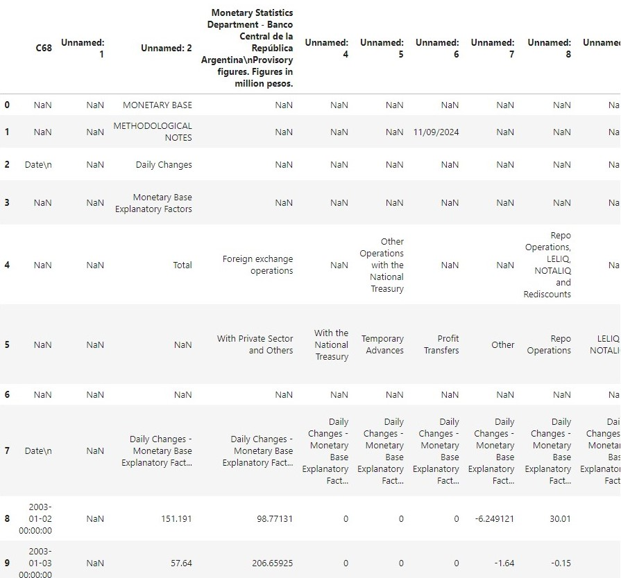
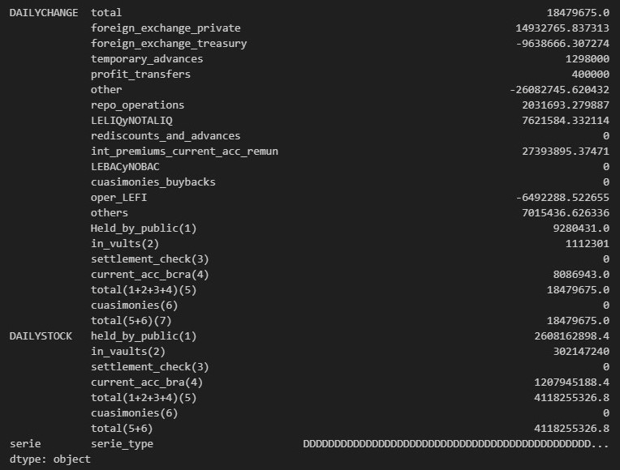
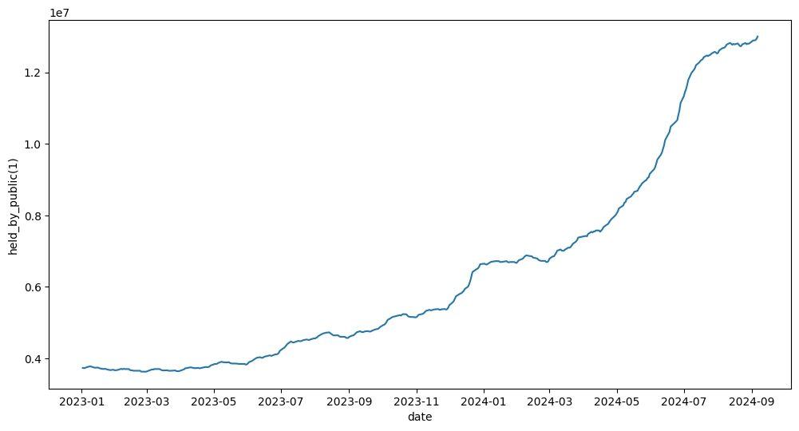
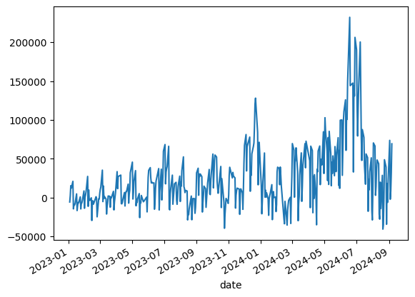
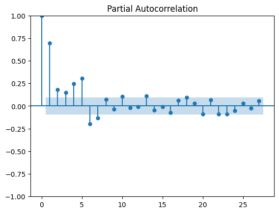
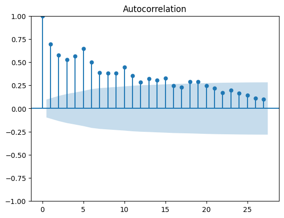
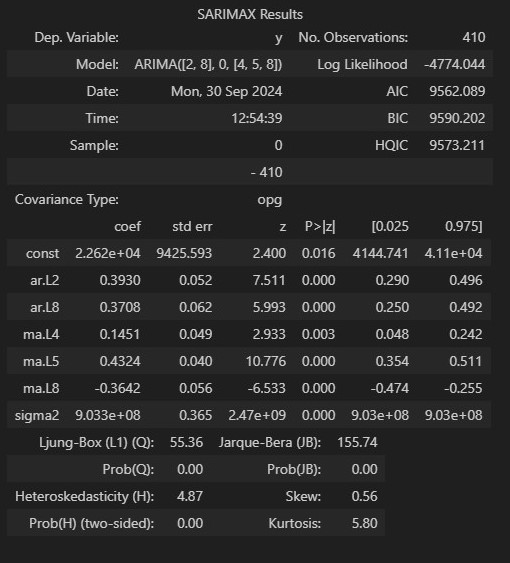
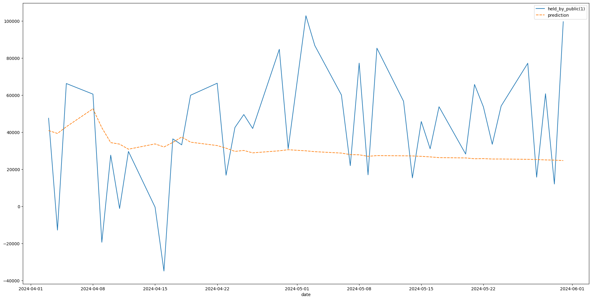

Read excel file, clean it and build ARIMA model to predict Argentina's monetary base change 

The excel file was downloaded from official BCRA website (https://www.bcra.gob.ar/)

## About the notebook

The first task to solve was the multi-heads columns obtained by transforming the excel file into a data frame.

 

After a bit of cleaning we got a dataframe with multiple columns indexes: **DAILYCHANGE** and **DAILYSTOCK**, both offering the same most important features but one shows the daily change and the other the total stock at a particular day. In addition **DAILYCHANGE** offers additional columns to show certain BCRA assets in more detail.

## ARIMA model

Our aim is to predict the feature **held_by_public_(1)** defined by: monetary circulation that is not in the possession of financial entities.

At first sight we can see that it is not stationary, then we must use differencing

where we apply Dicker-Fuller test obtaining a **p value of 0.00046844795099990213** 

Then we get **auto-correlation** and **partial-autocorrelation** functions

## Result

Showing some effectiveness during the first two weeks until approximately 04/15/2024, when it begins to converge towards the media.

